<p align="center">
  <picture>
    <source media="(prefers-color-scheme: dark)" srcset=".github/assets/header.svg" />
    <source media="(prefers-color-scheme: light)" srcset=".github/assets/header.svg" />
    
  </picture>
</p>

<p align="center">
  <strong>A fast, GPU-rendered, telemetry-free code, text &amp; Markdown-notes editor. Present day, present text.</strong>
</p>

<p align="center">
  <a href="#what-is-this">About</a> &nbsp;&middot;&nbsp;
  <a href="#installation">Install</a> &nbsp;&middot;&nbsp;
  <a href="#quick-start">Quick Start</a> &nbsp;&middot;&nbsp;
  <a href="#capabilities">Capabilities</a> &nbsp;&middot;&nbsp;
  <a href="PRIVACY.md">Privacy</a> &nbsp;&middot;&nbsp;
  <a href="#contributing">Contributing</a>
</p>

<p align="center">
  
  
  
  
  
</p>

---

## What is this?

SCR1B3 (pronounced "scribe") is a code, text, and Markdown-notes editor built in Rust for people who want a fast, native editor that respects them. It opens multi-gigabyte files without freezing, doubles as a Markdown note-taking workspace (templates, task boxes, live preview), themes all the way down, and never phones home.

The text engine is a rope buffer, and memory-mapped read-only browsing means files far larger than RAM open instantly and stay smooth to scroll. Syntax highlighting runs on an engine-agnostic backend: a native tree-sitter grammar (Rust today) drives structure-aware coloring where one is wired, with syntect covering 100+ more languages with no per-language build step. Everything — appearance, fonts, behavior, themes — is driven by a single live-reloading TOML config. No webview, no account, no bloat.

The name is a nod to *Serial Experiments Lain*. Good tools don't call attention to themselves. They just work when you reach for them — present day, present text.

## Installation

Download the build for your platform from the
[**Releases**](https://github.com/46b-ETYKiAL/SCR1B3/releases)
page — that is the single maintained install channel. Every release ships one
signed `SHA256SUMS` manifest (plus `SHA256SUMS.minisig`) covering every
artifact, and a `.minisig` signature next to each artifact; verify before
running.

### Windows

Download `scr1b3-<version>-x86_64-setup.exe` and run it — the Itasha.Corp
installer installs SCR1B3 per-machine with a Start-Menu shortcut. (Prefer no
installer? Grab the `scr1b3-x86_64-pc-windows-msvc.tar.gz` portable build.)

### macOS / Linux

Download the `scr1b3-<target>.tar.gz` for your platform, extract it, and run the
`scr1b3` binary:

```bash
# Linux x86_64
tar -xzf scr1b3-x86_64-unknown-linux-gnu.tar.gz && ./scr1b3
# macOS (Apple Silicon)
tar -xzf scr1b3-aarch64-apple-darwin.tar.gz && ./scr1b3
```

### Build from source

Requires a [Rust toolchain](https://rustup.rs/) (the pinned version is in `rust-toolchain.toml`).

```bash
git clone https://github.com/46b-ETYKiAL/SCR1B3
cd SCR1B3
cargo build --release
# binary at target/release/scr1b3
```

## Quick Start

Open a file directly from the command line:

```bash
scr1b3 path/to/file.rs
```

Or launch SCR1B3 and open files from the editor. On first run it writes nothing outside its own config directory; a missing config uses built-in defaults, and a malformed one falls back to defaults and surfaces the error in-app — the editor never refuses to start.

```
┌──────────────────────────────────────────┐
│  SYSTEM NOTICE                           │
│  ──────────────────────────────────────  │
│  NODE TYPE : EDITOR                      │
│  STATUS    : ACTIVE                      │
│  TELEMETRY : NONE                        │
└──────────────────────────────────────────┘
```

## Capabilities

- **Large files without the freeze** — a rope buffer plus `mmap` read-only browse open multi-GB logs and files that defeat the 2 GB cap and 4×-RAM blowups of legacy editors, and stay responsive while you scroll.
- **GPU-rendered** — smooth scrolling on a hardware-accelerated egui surface, with no system webview in the loop.
- **100+ languages** — engine-agnostic highlighting: a native tree-sitter grammar (Rust today) gives structure-aware coloring where one is wired, with syntect covering 100+ more TextMate / Sublime syntaxes unchanged; broader tree-sitter coverage and folding are in progress.
- **Power editing surfaces** — split view over a shared buffer, a document minimap with click-to-jump, brace-aware code folding, and an identifier completion popup (Ctrl/Cmd+Space) — all toggleable from the quick-access toolbar, the command palette (Ctrl+Shift+P), or Settings.
- **Command palette** — press Ctrl+Shift+P (or the `⌘` / `>_` toolbar button) to fuzzy-search and run every built-in action and installed plugin command (~70 commands).
- **Navigation & search** — project-wide find-in-files (Ctrl+Shift+F), a fuzzy file finder (Ctrl+P), go-to-line (Ctrl+G) and go-to-symbol (Ctrl+Shift+O), line bookmarks, and an F1 keyboard cheatsheet.
- **Notes & Markdown** — a dedicated note colour theme (20 presets) plus toggleable Markdown accent passes for decorative dividers (`----`, `====//====//`), `#tags`, `~~strikethrough~~`, `[ ]`/`[x]` task boxes, and table pipes.
- **Note authoring** — note templates (checklist / meeting / daily), task checkboxes, inline Markdown formatting chords (bold / italic / inline-code / strikethrough), table formatting, case conversion, and a Markdown live preview (Ctrl+Shift+V).
- **Right-click editing** — a context menu with clipboard actions plus Markdown formatting (bold / italic / inline-code / strikethrough, toggle task box, format table, Title Case, insert date-time).
- **Telemetry-free by default** — no account, no analytics, no usage beacons. Your file contents never leave your device.
- **Deep theming** — live-reload Helix-style `[palette]` / `[ui]` / `[syntax]` TOML themes, including glass / transparency effects; ship your own without recompiling. Broken themes fall back to the compiled-in default, so the editor never blanks.
- **LSP diagnostics** — language-server integration surfaces errors, warnings, and hints inline.
- **Modern editing** — multi-tab, multi-cursor / column selection, find / replace with full regex and capture-group replacement, memoized syntax-highlight layout, and encoding + EOL detection that round-trips files unmodified.
- **Plugins** — a capability-consent user plugin system scripted in [Rhai](https://rhai.rs) (pure-Rust, sandboxed by construction — no filesystem or network access, bounded by an operation count and a wall-clock deadline so a runaway script can't hang the editor), with minisign-signed tarballs verified against a TOFU-pinned key store.
- **Offline spellcheck** — fully offline, code-aware (comments / strings), on by default.
- **Default-app integration (opt-in)** — register SCR1B3 as the default handler for plain-text / Markdown / JSON / source-code files from **Settings → Default app**; per-OS (Windows ProgID / macOS UTI / Linux MIME). Off until you ask. `scr1b3 a.rs b.rs c.txt` also opens multiple files at once.
- **Signed auto-update** — telemetry-free version check against the public GitHub Releases API only, cryptographically verified before swap, fully opt-out.
- **Tiny binary** — `strip`ped, LTO release build. No Chromium, no system webview, hundreds of MB lighter than Electron editors.

<details>
<summary><strong>Technical Context</strong></summary>

SCR1B3 is a Cargo workspace: `scribe-core` holds the rope-backed text engine, encoding / EOL detection, syntect + tree-sitter highlighting, and the offline spellchecker; `scribe-render` maps themes to the GPU surface and hosts the large-file rope viewport widget; `scribe-app` is the binary that wires them into a frameless, native-feel window.

The text engine uses a rope (`ropey`), whose insertions and deletions are O(log n) at the buffer level. Read-only browsing of very large files is backed by `mmap` with a viewport-culled rope widget, so the OS pages content on demand rather than loading the whole file into memory, and only the visible rows are laid out per frame. The editable path currently uses egui's `TextEdit::multiline`, so the rope-viewport huge-file speed applies to read-only browsing today; threading the owned editing layer through the rope widget is in progress. Highlighting layers syntect (TextMate / Sublime grammars, 100+ languages bundled) with tree-sitter (Rust grammar today) for structure-aware features.

Configuration is a single TOML file that live-reloads on change. Themes use a three-namespace schema (`[palette]` / `[ui]` / `[syntax]`) with palette-name references and `#RRGGBB` / `#RRGGBBAA` literals; the default theme is `itasha-corp` — the shared house-brand palette: cool near-black layers, off-white text, one teal accent (the system voice), Akira-red reserved for alarms. 34 themes ship in the binary (the calm canon — `itasha-corp`, `wired-noir`, `phosphor-amber`, `lain-mauve`, `ghost-paper`, `a11y-high-contrast`, plus the accessibility variants `wired-colorblind` and `itasha-void-high-contrast` — plus the itasha-neon, heritage-alt, and Wave-4 families); user themes drop in `<config_dir>/themes/` and override built-ins of the same name. A broken theme falls back to `wired-noir`. The plugin system is capability-consented: plugins declare the capabilities they need and you approve them. Scripts run in an embedded [Rhai](https://rhai.rs) interpreter that is sandboxed by construction (no ambient filesystem or network access) and bounded by both an operation-count ceiling and a wall-clock deadline, so a misbehaving or runaway plugin cannot hang or compromise the editor.

</details>

## Configuration

SCR1B3 reads a single live-reloading TOML file from your OS config directory. A missing file uses built-in defaults; a malformed file falls back to defaults and surfaces the error in-app. Every key across all twelve tables — `[editor]`, `[appearance]`, `[fonts]`, `[window]`, `[updates]`, `[spellcheck]`, `[plugins]`, `[toolbar]`, `[motion]`, `[scroll]`, `[reporting]`, `[integration]` — is documented with types, defaults, and a full example in **[CONFIG.md](CONFIG.md)**.

## Theming

Themes use a Helix-style three-namespace TOML schema (`[palette]` / `[ui]` / `[syntax]`) with palette-name references and `#RRGGBB` / `#RRGGBBAA` literals. SCR1B3 ships **34 built-in themes**. The calm canon is `itasha-corp` (default, house brand), `wired-noir` (brand canon), `phosphor-amber` (BBS heritage), `lain-mauve` (Wired violet), `ghost-paper` (light, WCAG AA), `a11y-high-contrast` (WCAG AAA-target for low-vision users), and the accessibility variants `wired-colorblind` (deuteranopia/protanopia-safe) and `itasha-void-high-contrast` (high-contrast void); the rest are the itasha-neon, heritage-alt, and Wave-4 families (see [THEMING.md](THEMING.md) for the full list). Pick one from **Settings → Appearance → Theme**, drop a user theme in `<config_dir>/themes/` to override, or click **Export to user theme** to fork the active theme to disk and edit it by hand (the live-reload watcher applies your changes immediately). Broken themes fall back to `wired-noir` so the editor never blanks. A live window colour tint (Settings → Window: enable + colour + strength) blends over the app background in real time. The motion settings (master switch, intensity, cursor blink) live in `[motion]`, alongside the CRT/retro ambience overlays — scanlines, flicker, VHS tracking and the Wired ambient mesh. Subtle motion is ON by default; each CRT/VHS overlay is individually OFF by default, and all motion is suppressed when your OS asks for reduced motion (WCAG 2.3.3). These are painter overlays, not a GPU shader pass, so the shader-only effects (phosphor glow, bloom, curvature, chromatic aberration) are not implemented — see [THEMING.md](THEMING.md#crt-effects-shipped-as-painter-overlays-not-a-gpu-shader). Full guide: **[THEMING.md](THEMING.md)**.

## Plugins

SCR1B3 supports a user plugin system with a **capability-consent model**: plugins declare the capabilities they need and you approve them on install. Scripts run in an embedded [Rhai](https://rhai.rs) interpreter — pure-Rust, sandboxed by construction (no ambient filesystem or network access), bounded by an operation-count ceiling and a wall-clock deadline so a runaway plugin cannot hang or compromise the editor. Plugins ship as tarballs signed with [minisign](https://jedisct1.github.io/minisign/) (ed25519) and verified against a TOFU-pinned key store before install. See **[PLUGINS.md](PLUGINS.md)**.

## Tech Stack

| Layer | Technology |
|-------|------------|
| Core engine | Rust, ropey |
| Highlighting | syntect, tree-sitter |
| Rendering | egui on a GPU surface |
| Config / themes | TOML (live-reload) |
| Plugins | Rhai (sandboxed, capability-consented, minisign-signed) |
| License | MIT OR Apache-2.0 |

## Status


> [!TIP]
> This project is open source under the MIT OR Apache-2.0 license. Contributions welcome.

## Contributing

Contributions are welcome. SCR1B3 is a Cargo workspace (`scribe-core` / `scribe-render` / `scribe-app`). Build with `cargo build`, test with `cargo nextest run`, and pass `cargo fmt --check` + `cargo clippy -D warnings` before opening a PR. Please read **[CONTRIBUTING.md](CONTRIBUTING.md)** and the [Architecture Decision Records](docs/adr/), and review our **[Code of Conduct](CODE_OF_CONDUCT.md)** before participating.

Found a security issue? Please follow the disclosure process in **[SECURITY.md](SECURITY.md)** — do not open a public issue for vulnerabilities.

SCR1B3 is **telemetry-free by construction**. The full transparency record — exactly which network calls the app makes (one: the opt-out auto-update version check), exactly what it sends, what it doesn't, no fingerprinting, no install-id, offline mode, local-only state, and a "clear local data" control — is in **[PRIVACY.md](PRIVACY.md)**.

## License

SCR1B3 is dual-licensed under either of:

- **MIT License** ([LICENSE-MIT](LICENSE-MIT))
- **Apache License, Version 2.0** ([LICENSE-APACHE](LICENSE-APACHE))

at your option. Unless you explicitly state otherwise, any contribution intentionally submitted for inclusion in this project by you, as defined in the Apache-2.0 license, shall be dual-licensed as above, without any additional terms or conditions.

Bundled fonts (JetBrains Mono OFL-1.1, Hack MIT, Ubuntu UFL-1.0) and the full transitive Cargo-dependency license inventory are documented in **[THIRD-PARTY-LICENSES.md](THIRD-PARTY-LICENSES.md)**.

<p align="center">
  <picture>
    <source media="(prefers-color-scheme: dark)" srcset=".github/assets/footer.svg" />
    <source media="(prefers-color-scheme: light)" srcset=".github/assets/footer.svg" />
    
  </picture>
</p>
